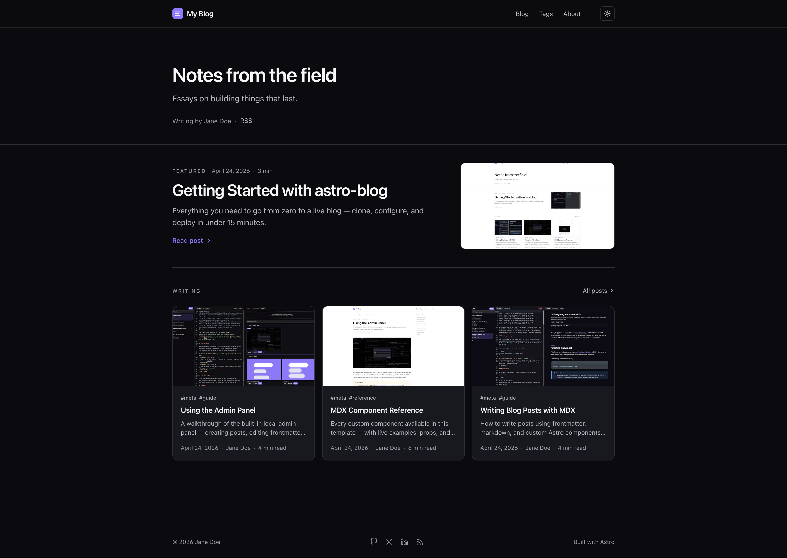
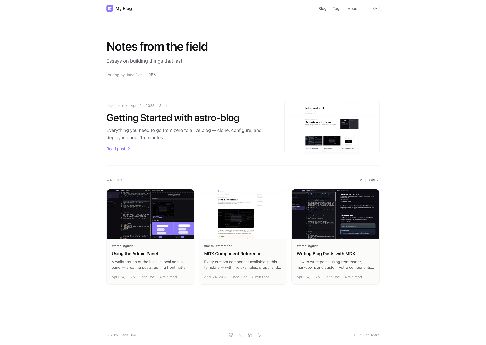
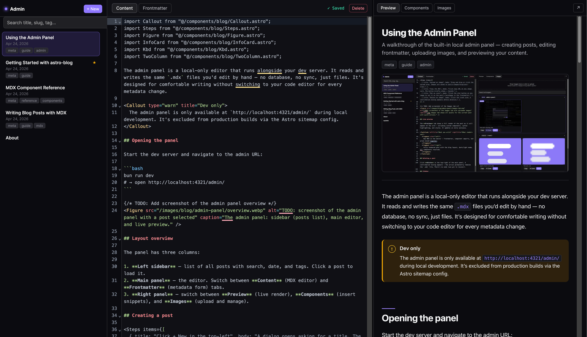
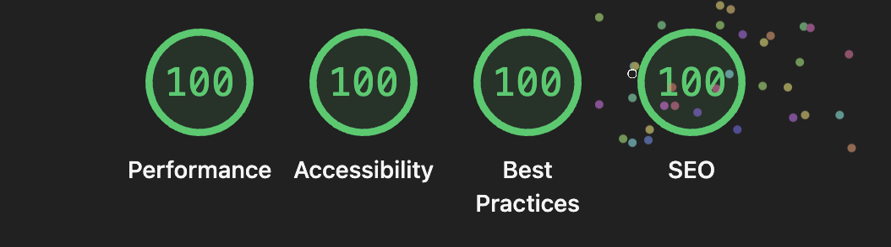

<h1 align="center">astro-blog 📝</h1>

<p align="center">
The blog template that ships with a <b>browser-based admin panel</b> — write and publish MDX posts without touching a text editor.<br>
Built on <b>Astro 6 + Tailwind CSS 4</b>, zero JS on reading pages, 100 Lighthouse across all four categories.
</p>

<p align="center">
  <a href="https://github.com/vstorm-co/astro-blog/actions/workflows/ci.yml"></a>
  <a href="https://astro.build"></a>
  <a href="https://nodejs.org"></a>
  <a href="https://bun.sh"></a>
  <a href="https://opensource.org/licenses/MIT"></a>
  <a href="https://github.com/vstorm-co/astro-blog/blob/main/SECURITY.md"></a>
  <a href="https://x.com/Kacper95682155"></a>
</p>

<p align="center">
  <a href="https://astro-blog-kappa-rouge.vercel.app/">
    
  </a>
</p>

<table width="100%"><tr>
  <td width="50%"></td>
  <td width="50%"></td>
</tr></table>

<p align="center">
  
</p>

---

## 🚀 Quick Start

```bash
bunx degit vstorm-co/astro-blog my-blog && cd my-blog && bun install && bun run dev
```

Open **http://localhost:4321/admin/** — your blog editor is ready.

> **npm users:** `npx degit vstorm-co/astro-blog my-blog && cd my-blog && npm install && npm run dev`

---

## ✨ Features

- 🛠 **Built-in admin panel** — browser-based MDX editor with live preview, autosave, drag-and-drop images, and a component palette. Stripped from every production build.
- ⚡ **Zero JS on reading pages** — no framework runtime, no hydration cost. Home page ships 0 KB of JavaScript.
- 📝 **MDX-first** with 22 ready-made blog components: `Callout`, `Figure`, `Stat`, `Timeline`, `Terminal`, `FileTree`, `Diff`, `Gallery`, `Tweet`, `Bookmark`, and more
- 🎨 **Single-file config** — title, author, nav, socials, accent colour, feature flags all in `src/site.config.ts`
- 🌗 **Dark + light mode** with pre-paint init (zero FOUC) and `prefers-color-scheme` fallback
- ✍️ **Scheduled posts** — set a future `pubDate`, post goes live on the next build after that time
- 🏷️ **Tag pages** auto-generated from frontmatter
- 📡 **RSS feed, sitemap, robots.txt** built at compile time
- 🚀 **One-click deploy** to Vercel, Netlify, or Cloudflare Pages
- 🔷 **TypeScript + Zod schemas** — typed frontmatter, zero runtime surprises
- 🔒 **ESLint + Prettier + Husky** — enforced code style from the first commit

---

## ✅ Lighthouse Score

<p align="center">
  
</p>

---

## 🆚 Why astro-blog?

|                              | **astro-blog** | AstroPaper | Fuwari | Raw Astro |
| ---------------------------- | :------------: | :--------: | :----: | :-------: |
| Admin panel (browser editor) |       ✅       |     ❌     |   ❌   |    ❌     |
| Zero JS on reading pages     |       ✅       |     ❌     |   ❌   |    ✅     |
| 100 Lighthouse (all 4)       |       ✅       |     ✅     |   —    |     —     |
| 22 MDX components            |       ✅       |     ❌     |   ❌   |    ❌     |
| Drag-and-drop image upload   |       ✅       |     ❌     |   ❌   |    ❌     |
| Scheduled posts              |       ✅       |     ❌     |   ❌   |    ❌     |
| Single-file config           |       ✅       |     ✅     |   ✅   |    ❌     |
| Dark + light mode            |       ✅       |     ✅     |   ✅   |     —     |
| One-click deploy             |       ✅       |     ✅     |   ✅   |     —     |

The admin panel is the differentiator — no other Astro blog template ships one.

---

## 🛠 First 10 Minutes

After cloning, open `src/site.config.ts` and work through this list:

1. **Set your identity** — `website`, `title`, `author`, `description`, `accent`
2. **Update socials** — edit `src/socials.ts`, keep only the providers you use
3. **Rewrite the About page** — `src/data/pages/about.mdx` or use the admin panel
4. **Delete example posts** — remove everything in `src/data/blog/` and write your own
5. **Replace the favicon** — drop your SVG at `public/favicon.svg`
6. **Set an OG image** — 1200×630 PNG at `public/og-default.png` (or run `python3 scripts/generate-og.py`)
7. **Deploy** — push to GitHub and click one of the deploy buttons below
8. **Protect `main`** — on GitHub: require PR + CI green before merge
9. **Turn on Discussions** — for open-ended questions from readers
10. **Fill `.github/FUNDING.yml`** — if you accept sponsorship

---

## 🖊️ Writing Posts

### Option A — Admin panel (recommended)

Start the dev server and open `localhost:4321/admin/`:

- **Split-pane MDX editor** with autosave (2 s debounce, `Cmd+S` forces save)
- **Component palette** — click Insert, snippet + import land at your cursor
- **Image drag-and-drop** — files written to `public/images/blog/<slug>/`
- **Live preview** inside an iframe of the real post layout
- **Rename slug / delete post** from the sidebar

The admin panel is dev-only — production builds 404 the route.

### Option B — CLI

```bash
bun run new-post "My post title"
# → src/data/blog/my-post-title.mdx  (draft: true by default)
```

### Frontmatter reference

```yaml
---
title: "My post title"
description: "One-line summary — used in meta tags and post cards."
pubDate: 2026-05-01
updatedDate: 2026-05-15 # optional
author: "Jane Doe"
tags: ["astro", "mdx"]
draft: false # excluded from prod builds when true
featured: false # pinned to the home page featured strip
cover: "./cover.jpg" # optional, relative to the MDX file
ogImage: "/custom-og.png" # optional per-post OG override
canonicalURL: "https://…" # optional, for cross-posts
---
```

### Scheduling a post

Set `pubDate` to a future date. The post is invisible until the next build after that time. For automatic builds:

1. Add a `DEPLOY_HOOK_URL` repo secret (Vercel / Netlify / CF each provide one).
2. Set repo variable `SCHEDULED_REBUILD=1`.
3. `.github/workflows/scheduled-rebuild.yml` hits the hook hourly.

---

## 🧩 MDX Components

22 components grouped by purpose:

| Group         | Components                                               |
| ------------- | -------------------------------------------------------- |
| **Prose**     | `Callout` `InfoCard` `PullQuote` `Aside`                 |
| **Data**      | `Stat` `TwoColumn` `Comparison` `Timeline`               |
| **Media**     | `Figure` `Gallery` `VideoEmbed` `Tweet` `Bookmark`       |
| **Technical** | `CodeGroup` `Terminal` `FileTree` `Diff` `Kbd` `Details` |
| **Structure** | `Steps` `Badge` `Divider`                                |

All components live in `src/components/blog/`. See them in action in `src/data/blog/mdx-component-reference.mdx`.

### Adding your own component

Drop an `.astro` file in `src/components/blog/` with three annotation comments:

```astro
{/* @mdx-label MyComponent */}
{/* @mdx-description One-line description shown in the palette. */}
{
  /* @mdx-snippet
<MyComponent prop="example">
  Body text
</MyComponent>
*/
}
```

The admin palette picks it up on the next refresh — no other code changes needed.

---

## ⚙️ Configuration

| File                    | What you change                                           |
| ----------------------- | --------------------------------------------------------- |
| `src/site.config.ts`    | Title, author, nav, socials, accent colour, feature flags |
| `src/socials.ts`        | Social links and share targets                            |
| `src/styles/global.css` | Design tokens — colours, fonts, radii, shadows            |
| `src/styles/prose.css`  | Post body typography                                      |
| `src/data/blog/`        | Blog posts                                                |
| `src/data/pages/`       | About / Uses / Now / etc.                                 |
| `public/favicon.svg`    | Favicon                                                   |
| `public/og-default.png` | Default OG image (1200 × 630 px)                          |

### Feature flags

```ts
features: {
  search: false,           // Pagefind-powered /search/ page (requires build step)
  archive: true,           // /archive/ — chronological post list
  dynamicOg: false,        // per-post OG via Satori
  editPost: false,         // "Edit on GitHub" link on each post
  adminPanel: true,        // dev-only admin UI
  lightAndDarkMode: true,  // theme toggle visible / hidden
}
```

---

## ⚡ Commands

| Command                    | Action                               |
| -------------------------- | ------------------------------------ |
| `bun run dev`              | Start dev server at `localhost:4321` |
| `bun run build`            | Type-check + build to `./dist/`      |
| `bun run preview`          | Preview the production build locally |
| `bun run new-post "Title"` | Scaffold a new draft post            |
| `bun run optimize-images`  | Resize + convert blog images to WebP |
| `bun run lint`             | Run ESLint                           |
| `bun run format`           | Format with Prettier                 |
| `bun run test`             | Run Vitest unit tests                |

---

## 🗂 Project Structure

```
src/
├─ site.config.ts       # ← start here: identity, nav, features
├─ socials.ts
├─ content.config.ts    # Zod schemas
├─ data/
│  ├─ blog/             # MDX posts
│  └─ pages/            # About, Uses, etc.
├─ layouts/             # Base / Post / Page
├─ components/
│  ├─ blog/             # 22 MDX components
│  ├─ layout/           # Header / Footer / SEO
│  ├─ home/             # Hero / LatestPosts / FeaturedStrip
│  ├─ post/             # PostCard / TOC / Pagination / ShareLinks
│  ├─ islands/          # React islands (CopyCode, Search, TOC scrollspy)
│  └─ admin/            # dev-only admin panel
├─ lib/
│  ├─ posts.ts          # content helpers
│  ├─ schemas.ts        # JSON-LD builders
│  └─ slug.ts
├─ pages/               # file-based routes
└─ styles/              # global.css, prose.css

public/
├─ favicon.svg
├─ og-default.png
├─ _headers / _redirects   # Cloudflare Pages headers
└─ images/blog/<slug>/     # per-post images (managed by admin)

scripts/
├─ new-post.ts             # post scaffolder
├─ optimize-images.py      # WebP optimiser
└─ generate-og.py          # OG image generator
```

---

## 🚢 Deploy

| Platform             | One-click                                                                                                                                                      |
| -------------------- | -------------------------------------------------------------------------------------------------------------------------------------------------------------- |
| **Vercel**           | [](https://vercel.com/new/clone?repository-url=https://github.com/vstorm-co/astro-blog)                        |
| **Netlify**          | [](https://app.netlify.com/start/deploy?repository=https://github.com/vstorm-co/astro-blog) |
| **Cloudflare Pages** | [](https://deploy.workers.cloudflare.com/?url=https://github.com/vstorm-co/astro-blog)    |

Security headers and `/admin/*` blockers are pre-configured for all three in `vercel.json`, `netlify.toml`, and `public/_headers`.

---

## 🛠 Tech Stack

|                          |                                                                                                       |
| ------------------------ | ----------------------------------------------------------------------------------------------------- |
| **Framework**            | [Astro 6](https://astro.build)                                                                        |
| **Content**              | [MDX](https://mdxjs.com) + Astro Content Collections                                                  |
| **Styling**              | [Tailwind CSS 4](https://tailwindcss.com) + CSS custom properties                                     |
| **Syntax highlighting**  | [Shiki](https://shiki.style) via Expressive Code                                                      |
| **Editor (admin)**       | [CodeMirror 6](https://codemirror.net)                                                                |
| **Type checking**        | [TypeScript](https://www.typescriptlang.org) strict mode                                              |
| **Testing**              | [Vitest](https://vitest.dev)                                                                          |
| **Linting / formatting** | [ESLint](https://eslint.org) + [Prettier](https://prettier.io)                                        |
| **Git hooks**            | [Husky](https://typicode.github.io/husky) + [lint-staged](https://github.com/lint-staged/lint-staged) |

---

## ❓ FAQ

**Why Astro, not Next.js?**
Content-first. Zero JS by default, typed frontmatter via content collections, no runtime framework lock-in.

**Can I use pure Markdown instead of MDX?**
Yes — rename `.mdx` → `.md`. The content loader accepts both. MDX components only work in `.mdx` files.

**How do I add comments?**
We don't ship a comment system. [Giscus](https://giscus.app) takes ~10 lines at the bottom of `src/layouts/PostLayout.astro`.

**Is the admin panel safe to expose publicly?**
**No.** It has no authentication and writes to your filesystem. It binds to `127.0.0.1` in dev and production builds 404 the route.

**Will there be i18n?**
Not in this template. Use [Astro's i18n recipe](https://docs.astro.build/en/recipes/i18n/) directly.

---

## ⭐ Star History

<p align="center">
  <a href="https://www.star-history.com/#vstorm-co/astro-blog&type=date">
    
  </a>
</p>

---

## 🤝 Contributing

See [`CONTRIBUTING.md`](./CONTRIBUTING.md) for coding conventions, commit style, and how to run the test suite. Issues and PRs welcome.

Please read [`CODE_OF_CONDUCT.md`](./CODE_OF_CONDUCT.md) before participating. Report security vulnerabilities via [`SECURITY.md`](./SECURITY.md).

## 📄 License

[MIT](./LICENSE) © [Vstorm](https://github.com/vstorm-co)

---

<div align="center">

### Need a custom blog or content platform?

<p>We're <a href="https://vstorm.co"><b>Vstorm</b></a> — an Applied Agentic AI Engineering Consultancy.<br>
astro-blog is the template we use for our own writing. We build production-grade web apps too.</p>

<a href="https://vstorm.co/contact-us/">
  
</a>

<br><br>

Built on <a href="https://astro.build">Astro</a> · <a href="https://tailwindcss.com">Tailwind CSS</a> · <a href="https://mdxjs.com">MDX</a> · <a href="https://shiki.style">Shiki</a> · <a href="https://codemirror.net">CodeMirror</a>

</div>
