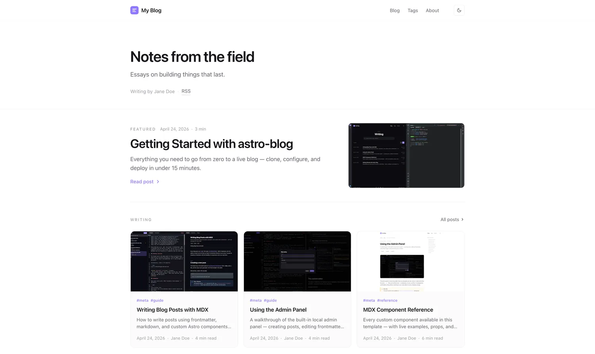
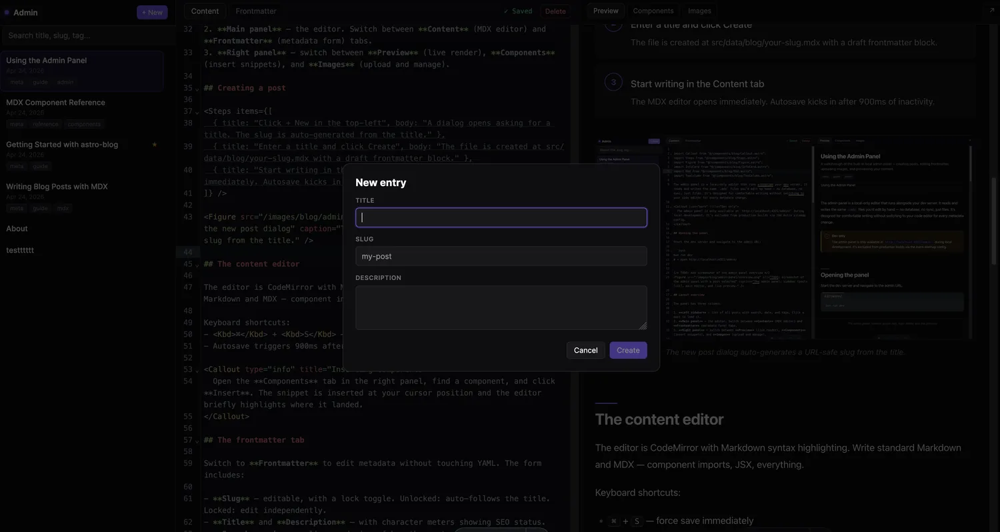
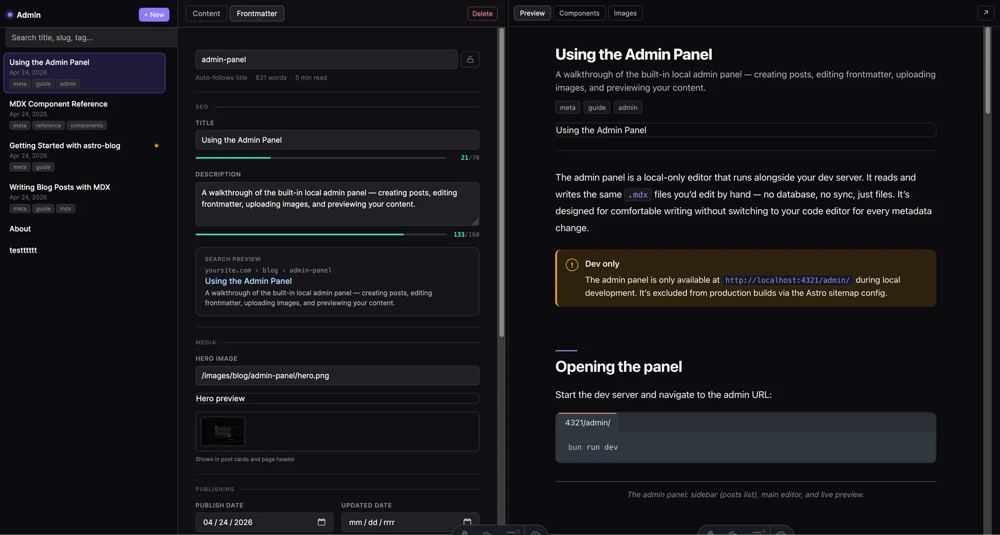

# astro-blog

> A fast, minimal, fork-friendly blog template for **Astro + MDX** — with a built-in **local admin panel**.

[](https://github.com/vstorm-co/astro-blog/actions/workflows/ci.yml)
[](https://astro.build)
[](https://nodejs.org)
[](https://bun.sh)
<br>
<a href="https://opensource.org/licenses/MIT"></a>
<a href="https://github.com/vstorm-co/astro-blog/blob/main/SECURITY.md"></a>
<a href="https://x.com/Kacper95682155"></a>

<p align="center">
  
</p>

<p align="center">
  
  
</p>

Home page with post list, single post pages, tag pages with filtering, a dedicated About page — and a dev-only admin GUI for writing MDX posts with a component palette and drag-and-drop images. Deploy to Vercel, Netlify, Cloudflare Pages, or GitHub Pages with zero config.

---

## Features

- ⚡ **Zero JS on reading surfaces.** Only the theme toggle ships as a React island.
- 📝 **MDX-first** with a curated library of 22 blog components (Callout, Figure, Stat, Timeline, Terminal, FileTree, Diff, Gallery, Tweet, Bookmark, …).
- 🛠 **Local admin panel.** Create, edit, preview, and publish posts in a browser. Stripped from every production build.
- 🎨 **Single-file configuration.** Title, author, nav, socials, accent color, feature flags — all in `src/site.config.ts`.
- 🌗 **Dark + light modes** with pre-paint theme init (no FOUC) and `prefers-color-scheme` fallback.
- ✍️ **Scheduled posts.** Set `pubDate` in the future; hide it until the next build after that time.
- 🏷 **Tag pages** generated from frontmatter.
- 📡 **RSS, sitemap, robots.txt** built at compile time.
- 🚀 **One-click deploy** to Vercel, Netlify, or Cloudflare Pages.

## Quick start

```bash
bunx degit vstorm-co/astro-blog my-blog
cd my-blog
bun install
bun run dev
```

Then open http://localhost:4321/admin/ to start writing.

**Prerequisites:** Bun ≥ 1.0 (primary) or Node ≥ 20.

## Deploy

One-click deploy URLs — replace `vstorm-co/astro-blog` once you've forked:

- **Vercel:** `https://vercel.com/new/clone?repository-url=https://github.com/vstorm-co/astro-blog`
- **Netlify:** `https://app.netlify.com/start/deploy?repository=https://github.com/vstorm-co/astro-blog`
- **Cloudflare Pages:** `https://deploy.workers.cloudflare.com/?url=https://github.com/vstorm-co/astro-blog`

Headers and the `/admin/*` blockers are pre-configured for all three in `vercel.json`, `netlify.toml`, and `public/_headers`/`public/_redirects`.

## First 10 minutes after cloning

1. **Rename the site.** Open `src/site.config.ts` and set `website`, `title`, `author`, `description`, `nav`, `accent`.
2. **Update socials.** Edit `src/socials.ts` — keep only the providers you use.
3. **Rewrite the About page.** Edit `src/data/pages/about.mdx` (or use the admin panel).
4. **Delete the example posts** in `src/data/blog/` and write your own.
5. **Replace the favicon** at `public/favicon.svg`.
6. **Choose an OG image.** Drop a 1200×630 PNG at `public/og-default.png`.
7. **Deploy.** Push to GitHub and click one of the deploy buttons above.
8. **Protect `main`.** On GitHub: require PR, require CI green.
9. **Turn on Discussions** for open-ended questions.
10. **Fill `.github/FUNDING.yml`** if you accept sponsorship.

## Writing posts

### Option A — Admin panel (recommended)

```bash
bun run dev
# http://localhost:4321/admin/
```

- Split-pane MDX editor with **autosave** (2 s debounce, `Cmd+S` forces save).
- Component palette — click **Insert**, the snippet lands at your cursor and the matching `import` is auto-added to the file.
- Image drag-and-drop (writes to `public/images/blog/<slug>/`).
- Browse images from your whole site grouped by folder.
- Live preview in an iframe of the real post layout.
- Rename slug / delete post from the sidebar.

The admin is dev-only — production builds 404 the route.

### Option B — CLI

```bash
bun run new-post "How I learned to love Astro"
# → creates src/data/blog/how-i-learned-to-love-astro.mdx (draft by default)
```

### Frontmatter

```mdx
---
title: "My post title"
description: "One-line summary used for meta + cards."
pubDate: 2026-04-24
updatedDate: 2026-05-01        # optional
author: "Jane Doe"
tags: ["astro", "mdx"]
draft: false                   # excluded from prod output
featured: false                # appears on the home page
cover: "./cover.jpg"           # optional, relative to the MDX file
ogImage: "/custom-og.png"      # optional OG override
canonicalURL: "https://…"      # optional, for crossposts
---
```

### Scheduling a post

Set `pubDate` to a future ISO date. Astro excludes it from every production route until the next build runs after that time. To re-run builds automatically:

1. Set a repo secret `DEPLOY_HOOK_URL` to your host's build-hook URL (Vercel/Netlify/CF all have one).
2. Set repo variable `SCHEDULED_REBUILD` to `1`.
3. `.github/workflows/scheduled-rebuild.yml` will hit the hook hourly.

## MDX components

Full list grouped by purpose:

- **Prose:** `Callout`, `InfoCard`, `PullQuote`, `Aside`
- **Data:** `Stat`, `TwoColumn`, `Comparison`, `Timeline`
- **Media:** `Figure`, `Gallery`, `VideoEmbed`, `Tweet`, `Bookmark`
- **Technical:** `CodeGroup`, `Terminal`, `FileTree`, `Diff`, `Kbd`, `Details`
- **Structure:** `Steps`, `Badge`, `Divider`

All components are in `src/components/blog/`. To see them all in action, read `src/data/blog/example-post.mdx`.

### Adding your own component

Drop an `.astro` file in `src/components/blog/` and include three JSX-style comments:

```astro
{/* @mdx-label YourName */}
{/* @mdx-description One-line description. */}
{/* @mdx-snippet
<YourName prop="example">
  Body
</YourName>
*/}
```

The admin palette picks it up on the next refresh — no code changes needed elsewhere.

## Configuration

| File | What you change |
|---|---|
| `src/site.config.ts` | Identity, nav, socials, feature flags, accent color, hero copy |
| `src/socials.ts` | `SOCIALS` + `SHARE_LINKS` |
| `src/styles/global.css` | Design tokens (colors, fonts, radii, shadows) |
| `src/styles/prose.css` | Post body typography |
| `src/data/blog/` | Blog posts |
| `src/data/pages/` | About / Uses / Now / etc. |
| `public/favicon.svg` | Favicon |
| `public/og-default.png` | Default Open Graph image (1200×630) |

### Feature flags

```ts
features: {
  search: false,              // Pagefind-powered /search/ (requires build step)
  archive: true,              // /archive/ chronological list
  dynamicOg: false,           // per-post OG via Satori (not yet wired in 0.1)
  editPost: false,            // "Edit on GitHub" link on posts
  adminPanel: true,           // dev-only; ignored in prod
  lightAndDarkMode: true,     // theme toggle shown / hidden
}
```

## Project structure

```
src/
├─ site.config.ts           # identity, nav, features (edit this first)
├─ socials.ts               # SOCIALS + SHARE_LINKS
├─ content.config.ts        # Zod schemas
├─ data/
│  ├─ blog/                 # MDX posts
│  └─ pages/                # About etc.
├─ layouts/                 # Base / Post / Page
├─ components/
│  ├─ blog/                 # 22 MDX components
│  ├─ layout/               # Header / Footer / SEO / Breadcrumbs
│  ├─ home/                 # Hero / LatestPosts / FeaturedStrip
│  ├─ post/                 # PostCard / TOC / Pagination / PrevNext / ShareLinks
│  ├─ islands/              # React islands (ThemeToggle)
│  └─ admin/                # dev-only admin panel
├─ lib/
│  ├─ admin/                # Vite dev middleware
│  ├─ posts.ts              # content helpers
│  ├─ schemas.ts            # JSON-LD builders
│  └─ slug.ts
├─ pages/                   # routes
└─ styles/                  # global.css, prose.css

public/
├─ favicon.svg
├─ og-default.png
├─ _headers / _redirects    # Cloudflare Pages
└─ images/blog/<slug>/      # per-post images (managed by admin)

.github/                    # CI, issue/PR templates, CODEOWNERS, dependabot
```

## FAQ

**Why Astro, not Next.js?**
Content-first. Zero JS by default, typed frontmatter via content collections, and no runtime framework lock-in.

**Can I use pure Markdown?**
Yes. Rename `.mdx` → `.md` — the content loader accepts both. MDX components won't work in `.md` files.

**How do I add comments?**
We don't ship a comment system. Giscus takes ~10 lines at the bottom of `src/layouts/PostLayout.astro`. See [giscus.app](https://giscus.app).

**Is the admin panel safe to expose publicly?**
**No.** It has no authentication and writes to your filesystem. It binds to `127.0.0.1` in `bun run dev` and refuses to serve if you add `--host <non-loopback>`. Production builds 404 the route; don't undo that.

**Will there be internationalization?**
Not in this template. Scope creep. Use [Astro's i18n recipe](https://docs.astro.build/en/recipes/i18n/) directly.

## Contributing

See [`CONTRIBUTING.md`](./CONTRIBUTING.md) for coding conventions, commit style, and how to run the test suite. Issues and PRs welcome.

Please read [`CODE_OF_CONDUCT.md`](./CODE_OF_CONDUCT.md) before participating. Report security issues via [`SECURITY.md`](./SECURITY.md).

## License

[MIT](./LICENSE) © [Vstorm](https://github.com/vstorm-co)

## Credits

- Inspired by [AstroPaper](https://github.com/satnaing/astro-paper).
- Built on [Astro](https://astro.build), [Tailwind CSS](https://tailwindcss.com), [MDX](https://mdxjs.com), [Shiki](https://shiki.style), and [CodeMirror](https://codemirror.net/).
